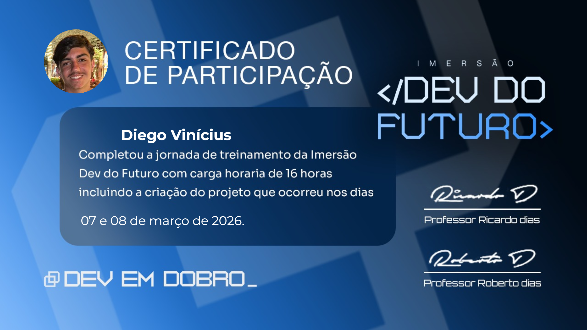

# 👋 Olá, eu sou Diego Vinícius

Sou desenvolvedor web em formação, atualmente estudando HTML, CSS e JavaScript para construção de interfaces modernas e funcionais.

Estou no início da minha jornada na programação, focado em aprender boas práticas, organização de código e desenvolvimento de projetos que fortaleçam minha base como desenvolvedor.

---

## 🚀 Atualmente estudando
- HTML5
- CSS3
- JavaScript
- Estruturação de páginas responsivas

---

## 🏆 Certificados

Certificado de participação na **Imersão Dev do Futuro** com 16 horas de carga horária, incluindo desenvolvimento de projeto prático.

---

## 🎯 Objetivo
Me desenvolver como profissional da área de tecnologia, evoluindo constantemente e construindo projetos cada vez mais completos.

---

## 📌 Projetos em desenvolvimento
Em breve novos projetos serão adicionados aqui.
